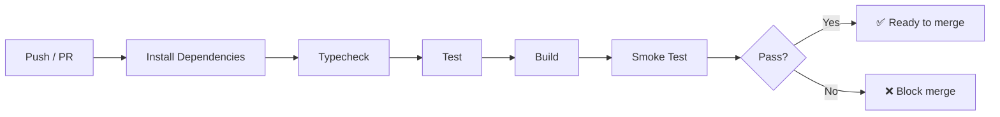

# GitHub Actions Workflows

## Active Workflows

| Workflow | File | Trigger | Purpose |
|----------|------|---------|---------|
| CI | `ci.yml` | Push / PR to `main` | Typecheck, test, build, smoke test |
| Pipeline | `pipeline.yml` | Schedule / Manual | Run ingestion cycle, process queue |

## CI Pipeline

### CI Steps

1. **Install** — `pnpm install --frozen-lockfile`
2. **Typecheck** — `pnpm turbo typecheck` (all packages)
3. **Test** — `pnpm turbo test` (contract + empty-state tests via Vitest)
4. **Build** — `pnpm turbo build` (production build of all apps)
5. **Smoke** — Route-level HTTP health check against production build

### Required Secrets

| Secret | Purpose |
|--------|---------|
| `DATABASE_URL` | PostgreSQL connection (Neon) |
| `REVALIDATION_TOKEN` | ISR cache busting |

## Planned Workflows

| Workflow | Purpose | Status |
|----------|---------|--------|
| Dependency audit | Automated `pnpm audit` + `pip-audit` | Planned |
| Preview deployments | Vercel preview per PR | Planned |
| Release | Version tagging + changelog | Planned |
