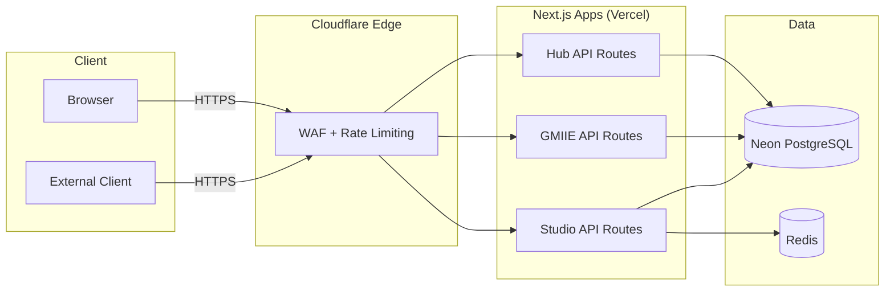
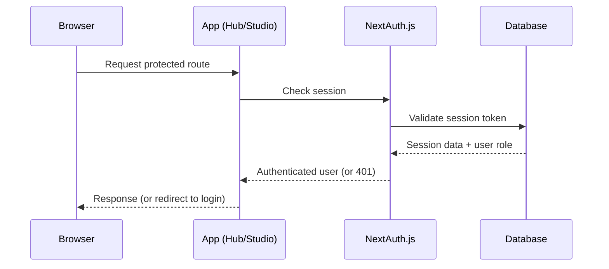

# API Overview

> **Status:** Complete · **Last Updated:** 2025-01

## Architecture

XXXIII.IO APIs are implemented as Next.js API Routes (App Router `route.ts` handlers) within each application. There is no standalone API gateway — each app exposes its own endpoints.



## Authentication Model

| App | Auth Required | Mechanism |
|-----|---------------|-----------|
| GMIIE | No | Public read-only |
| LPS | No | Static pages, no API |
| Hub | Yes | NextAuth.js session cookie |
| Studio | Yes | NextAuth.js session cookie + RBAC |

### Authentication Flow



## Request Lifecycle

1. **Client** sends HTTPS request
2. **Cloudflare** terminates SSL, applies WAF rules, rate limiting
3. **Vercel** routes to the correct Next.js app
4. **Next.js middleware** applies auth checks (if protected)
5. **Route handler** validates request body with Zod
6. **Prisma** executes database queries with parameterized SQL
7. **Response** returned as JSON with appropriate status code

## Core Endpoints

For detailed endpoint documentation, see the full [API Reference](../api.md).

### Articles

| Method | Endpoint | Auth | Description |
|--------|----------|------|-------------|
| GET | `/api/articles` | No | List articles with pagination |
| GET | `/api/articles/[id]` | No | Get single article by ID |
| POST | `/api/articles` | Yes | Create article (Studio) |
| PATCH | `/api/articles/[id]` | Yes | Update article (Studio) |
| DELETE | `/api/articles/[id]` | Yes | Delete article (Studio) |

### Topics

| Method | Endpoint | Auth | Description |
|--------|----------|------|-------------|
| GET | `/api/topics` | No | List all topics |
| GET | `/api/topics/[id]` | No | Get topic with articles |

### Entities

| Method | Endpoint | Auth | Description |
|--------|----------|------|-------------|
| GET | `/api/entities` | No | List entities |
| GET | `/api/entities/[id]` | No | Get entity details |

### Signals

| Method | Endpoint | Auth | Description |
|--------|----------|------|-------------|
| GET | `/api/signals` | No | List market signals |
| GET | `/api/signals/[id]` | No | Get signal details |

### Search

| Method | Endpoint | Auth | Description |
|--------|----------|------|-------------|
| GET | `/api/search` | No | Full-text search across articles |

### Feeds

| Method | Endpoint | Auth | Description |
|--------|----------|------|-------------|
| GET | `/api/feeds` | Yes | List configured feeds (Hub) |
| POST | `/api/feeds` | Yes | Add feed source (Hub) |

## Error Handling

All API responses follow a consistent error format:

```json
{
  "error": {
    "code": "VALIDATION_ERROR",
    "message": "Invalid request body",
    "details": [
      {
        "field": "title",
        "message": "Required"
      }
    ]
  }
}
```

### Status Codes

| Code | Meaning |
|------|---------|
| 200 | Success |
| 201 | Created |
| 400 | Validation error |
| 401 | Unauthorized |
| 403 | Forbidden (insufficient role) |
| 404 | Not found |
| 429 | Rate limited |
| 500 | Internal server error |

## Versioning

> **Current:** No versioning (v1 implicit)
> **Planned:** URL-based versioning (`/api/v2/...`) in Phase 9

## Cross-References

- [API Reference](../api.md) — Full endpoint documentation with request/response examples
- [Security Model](../security/security-model.md) — Auth and access controls
- [System Overview](../architecture/system-overview.md) — Architecture context
