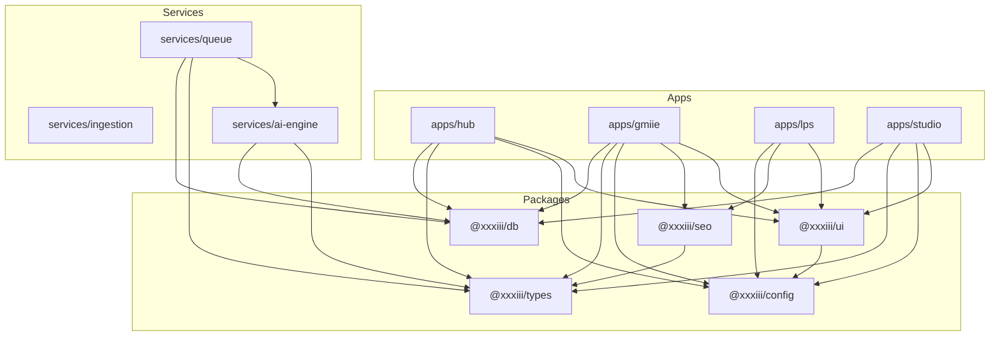
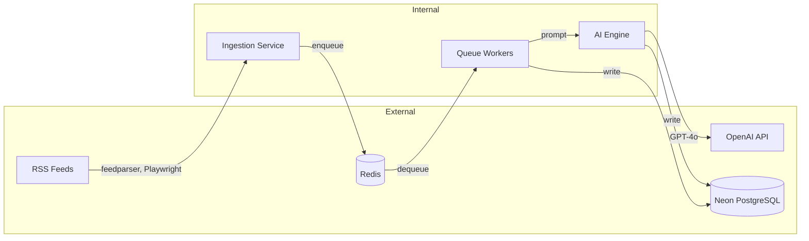

# Component Map

> **Status:** Complete · **Last Updated:** 2025-01

## Monorepo Dependency Graph

## Package Responsibilities

### @xxxiii/db
- Prisma schema (478+ lines, 15+ models)
- Client generation and exports
- Migration management
- Seed scripts

### @xxxiii/types
- Shared TypeScript interfaces
- Zod validation schemas (models.ts → schemas.ts)
- API request/response types
- Enum definitions (categories, tiers, statuses)

### @xxxiii/config
- ESLint configurations (shared rules)
- TypeScript base configs (tsconfig)
- Tailwind CSS presets
- PostCSS configuration

### @xxxiii/seo
- Meta tag generation
- Open Graph / Twitter Card helpers
- Sitemap generation
- JSON-LD structured data

### @xxxiii/ui
- Design system primitives
- Shared React components
- Theme tokens and CSS variables
- Layout components

## Service Boundaries

## Data Model Overview

| Model | Purpose | Key Relations |
|-------|---------|---------------|
| Article | Core content entity | → Topics, Entities, Signals |
| Topic | Category classification | → Articles (many-to-many) |
| Entity | Named entity (company, person, etc.) | → Articles, EntityMention |
| Signal | Market signal score | → Article |
| Source | Content source definition | → Articles |
| Feed | RSS feed configuration | → Source |
| Draft | AI-generated draft content | → Article |
| SeoMeta | SEO metadata | → Article |
| User | Platform user (Studio) | → Sessions, Accounts |
| Session | Auth session | → User |
| Account | OAuth account link | → User |
| QueueJob | Job tracking | — |
| AuditLog | System audit trail | → User |
| Newsletter | Newsletter content | → Articles |
| Sitemap | Sitemap entries | → Article |

## Cross-References

- [System Overview](system-overview.md) — High-level architecture
- [View-Model Contract](view-model-contract.md) — Data flow pattern
- [Project Structure](../developer/project-structure.md) — File system layout
