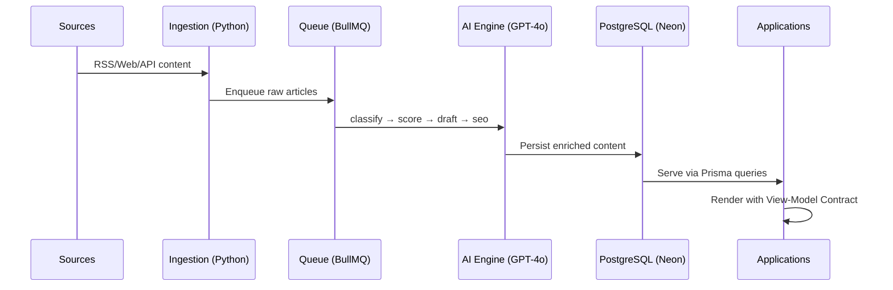

# System Overview

> **Status:** Complete · **Last Updated:** 2025-01

## Platform Summary

XXXIII.IO (GMIIE) is a real-time financial intelligence platform that ingests, classifies, scores, and publishes market-moving content across four consumer-facing applications. The system is built as a Turborepo monorepo deployed on Vercel with a PostgreSQL (Neon) data layer and a BullMQ + Redis queue backbone.

## High-Level Architecture

```mermaid
graph TB
  subgraph Sources
    RSS[RSS Feeds]
    WEB[Web Scraping]
    API_SRC[External APIs]
  end

  subgraph Ingestion["Ingestion Service (Python 3.12)"]
    FEED[feedparser]
    PLAY[Playwright]
    HTTPX[httpx]
  end

  subgraph Queue["Queue System (BullMQ + Redis)"]
    Q_ING[ingestion]
    Q_CLASS[classify]
    Q_SCORE[score]
    Q_DRAFT[draft]
    Q_SEO[seo]
    Q_REVIEW[review]
    Q_PUB[publish]
    Q_ENT[entity]
    Q_NEWS[newsletter]
    Q_SITE[sitemap]
    Q_MAINT[maintenance]
  end

  subgraph AI["AI Engine (GPT-4o)"]
    CLASSIFY[Classification]
    SCORING[Signal Scoring]
    DRAFTING[Content Drafting]
    SEO_GEN[SEO Generation]
    ENTITY_EX[Entity Extraction]
  end

  subgraph Data["Data Layer"]
    NEON[(Neon PostgreSQL)]
    PRISMA[Prisma 6.19 ORM]
  end

  subgraph Apps["Consumer Applications"]
    HUB[Hub :3000]
    GMIIE_APP[GMIIE :3001]
    LPS[LPS :3002]
    STUDIO[Studio :3003]
  end

  Sources --> Ingestion
  Ingestion --> Queue
  Queue --> AI
  AI --> Data
  Data --> Apps
```

## Application Map

| App | Port | Purpose | Auth |
|-----|------|---------|------|
| Hub | 3000 | Central dashboard, system health | NextAuth.js (RBAC) |
| GMIIE | 3001 | Public-facing financial intelligence feed | Open (read-only) |
| LPS | 3002 | Landing pages and marketing | Open |
| Studio | 3003 | Editorial and content management | NextAuth.js (RBAC) |

## Data Flow

## Technology Stack

| Layer | Technology | Version |
|-------|-----------|---------|
| Runtime | Node.js | 20+ |
| Framework | Next.js | 15.5 |
| UI | React | 19 |
| Language | TypeScript | 5.9 |
| Styling | Tailwind CSS | 4.x |
| ORM | Prisma | 6.19 |
| Database | PostgreSQL (Neon) | — |
| Queue | BullMQ + Redis | — |
| AI | OpenAI GPT-4o | — |
| Ingestion | Python (FastAPI) | 3.12 |
| Build | Turborepo | Latest |
| Package Manager | pnpm | 9.15+ |
| Deployment | Vercel | — |
| DNS/SSL | Cloudflare | — |
| Testing | Vitest | — |

## Shared Packages

| Package | Purpose |
|---------|---------|
| `@xxxiii/db` | Prisma client, schema, migrations |
| `@xxxiii/types` | Shared TypeScript types and Zod schemas |
| `@xxxiii/config` | Shared configuration (ESLint, Tailwind, TypeScript) |
| `@xxxiii/seo` | SEO utilities, meta generation, sitemap |
| `@xxxiii/ui` | Design system components |

## Services

| Service | Runtime | Purpose |
|---------|---------|---------|
| `ingestion` | Python 3.12 | RSS parsing, web scraping, API polling |
| `ai-engine` | Node.js | GPT-4o prompt orchestration, classification, scoring |
| `queue` | Node.js | BullMQ workers for 11 processing queues |

## Cross-References

- [Component Map](component-map.md) — Dependency graph and package relationships
- [View-Model Contract](view-model-contract.md) — Data contract architecture standard
- [API Reference](../api.md) — REST endpoint documentation
- [Deployment Guide](../operations/deployment-guide.md) — Infrastructure and deployment
