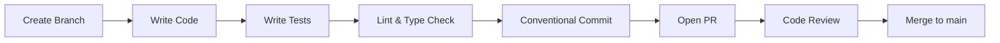

# Developer Contributing Guide

> **Status:** Complete · **Last Updated:** 2025-01

This guide supplements the top-level [CONTRIBUTING.md](../../CONTRIBUTING.md) with developer-focused workflows and standards.

## Development Workflow



### Branch Naming

```
feat/short-description       # New feature
fix/short-description        # Bug fix
refactor/short-description   # Code restructuring
docs/short-description       # Documentation
chore/short-description      # Maintenance
```

### Conventional Commits

```
type(scope): description

# Examples:
feat(gmiie): add article filter sidebar
fix(db): correct migration for entity index
refactor(ai-engine): extract prompt builder
docs(api): update endpoint documentation
test(types): add contract tests for Signal schema
chore(ci): add dependency audit step
```

**Scopes:** `hub`, `gmiie`, `lps`, `studio`, `db`, `types`, `config`, `seo`, `ui`, `ingestion`, `ai-engine`, `queue`, `infra`, `ci`, `docs`

## Code Standards

### TypeScript

```typescript
// ✅ Use explicit types for function signatures
function processArticle(article: Article): ProcessedArticle { }

// ✅ Use Zod schemas for runtime validation
const ArticleSchema = z.object({
  id: z.string().uuid(),
  title: z.string().min(1),
  content: z.string(),
});

// ✅ Use const assertions for enums
const STATUS = {
  DRAFT: 'draft',
  PUBLISHED: 'published',
  ARCHIVED: 'archived',
} as const;

// ❌ Avoid `any`
function process(data: any) { }

// ❌ Avoid non-null assertions
const value = data!.field;
```

### React Components

```tsx
// ✅ Use Server Components by default (Next.js 15)
export default async function ArticleList() {
  const articles = await getArticles();
  return <ArticleGrid articles={articles} />;
}

// ✅ Add 'use client' only when needed
'use client';
export function SearchFilter({ onFilter }: SearchFilterProps) { }

// ✅ Handle empty states
if (articles.length === 0) {
  return <EmptyState message="No articles found" />;
}
```

### Data Layer

```typescript
// ✅ Follow View-Model Contract
// 1. Define type (models.ts)
// 2. Create Zod schema (schemas.ts)
// 3. Fetch and validate (data.ts)
// 4. Consume in component

// ✅ Always validate data from database
const articles = await prisma.article.findMany();
const validated = validateMany(articles, ArticleSchema);
```

## Adding a New Feature

### Checklist

1. [ ] Define types in `packages/types/src/models.ts`
2. [ ] Create Zod schemas in `packages/types/src/schemas.ts`
3. [ ] Add data fetching in app's `lib/data.ts`
4. [ ] Use `validateOne` / `validateMany` for data validation
5. [ ] Build React components following Server/Client split
6. [ ] Handle empty states explicitly
7. [ ] Write contract tests (schema validation)
8. [ ] Write empty-state tests
9. [ ] Write smoke tests (basic rendering)
10. [ ] Update documentation if public API changes

### Database Changes

1. Modify `packages/db/prisma/schema.prisma`
2. Run `pnpm prisma migrate dev --name descriptive-name`
3. Run `pnpm prisma generate`
4. Update `@xxxiii/types` with new interfaces/schemas
5. Test migration on a Neon branch before merging

## Code Review Standards

### What Reviewers Look For

| Area | Check |
|------|-------|
| Types | No `any`, proper interfaces, Zod schemas present |
| Validation | Data validated at boundaries (API, DB, external) |
| Error Handling | Graceful errors, empty states, loading states |
| Security | No secrets in code, input sanitized, auth checked |
| Performance | No N+1 queries, proper pagination, minimal client JS |
| Testing | Contract, empty-state, and smoke tests present |
| Architecture | Follows View-Model Contract pattern |
| Documentation | API changes documented, comments for complex logic |

## Cross-References

- [CONTRIBUTING.md](../../CONTRIBUTING.md) — Top-level contribution policy
- [View-Model Contract](../architecture/view-model-contract.md) — Architecture pattern
- [Setup Guide](setup.md) — Environment setup
- [Project Structure](project-structure.md) — File layout
