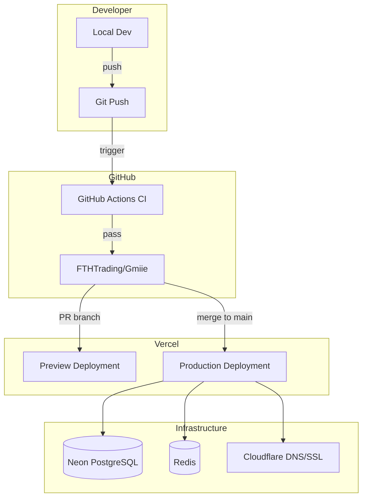

# Deployment Guide

> **Status:** Complete · **Last Updated:** 2025-01

## Deployment Architecture



## Environments

| Environment | Trigger | URL Pattern | Database |
|-------------|---------|-------------|----------|
| Development | Local `pnpm dev` | `localhost:300x` | Local or Neon dev branch |
| Preview | Pull request | `*.vercel.app` | Neon preview branch |
| Production | Merge to `main` | `xxxiii.io` | Neon production |

## Deployment Steps

### Production (Automatic)

1. Code merged to `main` branch
2. GitHub Actions CI runs (lint, type-check, build, test)
3. CI passes → Vercel auto-deploys all apps
4. Vercel builds each app in the monorepo
5. Cloudflare routes traffic to new deployment
6. Previous deployment retained as instant rollback target

### Manual Deployment (Emergency)

```bash
# Install Vercel CLI
pnpm add -g vercel

# Deploy specific app to production
cd apps/hub
vercel --prod

# Deploy all apps
vercel --prod
```

### Database Migrations

```bash
# Generate migration from schema changes
cd packages/db
pnpm prisma migrate dev --name <migration-name>

# Apply to production (via CI or manually)
pnpm prisma migrate deploy

# Verify migration status
pnpm prisma migrate status
```

## Environment Variables

### Required for All Apps

| Variable | Purpose | Where Set |
|----------|---------|-----------|
| `DATABASE_URL` | Neon PostgreSQL connection | Vercel Environment |
| `DIRECT_URL` | Neon direct connection (migrations) | Vercel Environment |

### Required for Authenticated Apps (Hub, Studio)

| Variable | Purpose |
|----------|---------|
| `NEXTAUTH_SECRET` | Session encryption key |
| `NEXTAUTH_URL` | Canonical app URL |

### Required for Services

| Variable | Purpose | Service |
|----------|---------|---------|
| `OPENAI_API_KEY` | GPT-4o API access | ai-engine |
| `REDIS_URL` | BullMQ connection | queue |

### Optional

| Variable | Purpose |
|----------|---------|
| `CLOUDFLARE_API_TOKEN` | DNS management |
| `VERCEL_TOKEN` | CLI deployments |

## Rollback Procedure

1. **Vercel Dashboard** → Deployments → Select previous deployment → Promote to Production
2. **CLI**: `vercel rollback` (rolls back to the previous successful deployment)
3. **Database**: Neon supports point-in-time recovery and branching for data rollback

## Pre-Deployment Checklist

- [ ] All CI checks pass (lint, types, build, test)
- [ ] Database migrations tested on preview branch
- [ ] Environment variables verified for target environment
- [ ] No pending security advisories (Dependabot)
- [ ] Breaking changes documented and communicated

## Monitoring Post-Deploy

- [ ] Verify Vercel deployment status (all apps healthy)
- [ ] Check Neon dashboard for database health
- [ ] Validate key user flows on production
- [ ] Monitor error rates in Vercel Analytics
- [ ] Confirm queue processing resumes (BullMQ dashboard)

## Cross-References

- [Runbooks](runbooks.md) — Incident response and operational procedures
- [Security Model](../security/security-model.md) — Security considerations for deployment
- [CI/CD Workflows](../../.github/workflows/README.md) — Pipeline documentation
