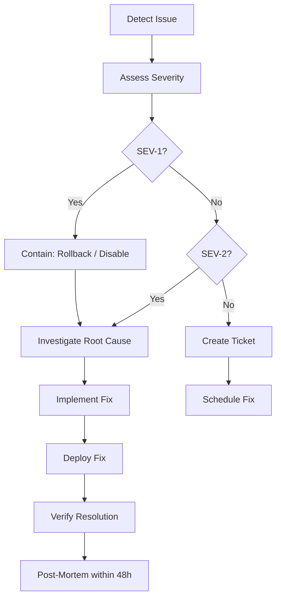

# Operational Runbooks

> **Status:** Complete · **Last Updated:** 2025-01

## Table of Contents

- [Health Checks](#health-checks)
- [Incident Response](#incident-response)
- [Common Issues](#common-issues)
- [Backup & Recovery](#backup--recovery)
- [Queue Management](#queue-management)
- [Database Operations](#database-operations)

---

## Health Checks

### Application Health

```bash
# Verify all apps are responding
curl -s -o /dev/null -w "%{http_code}" https://xxxiii.io          # GMIIE (200)
curl -s -o /dev/null -w "%{http_code}" https://hub.xxxiii.io      # Hub (200)
curl -s -o /dev/null -w "%{http_code}" https://studio.xxxiii.io   # Studio (200/302)
curl -s -o /dev/null -w "%{http_code}" https://lps.xxxiii.io      # LPS (200)
```

### Database Health

```bash
# Check Neon connection and basic query
cd packages/db
pnpm prisma db execute --stdin <<< "SELECT 1;"

# Check migration status
pnpm prisma migrate status
```

### Queue Health

```bash
# Check Redis connectivity
redis-cli -u $REDIS_URL ping

# Check queue depths (via BullMQ)
# Use the BullMQ dashboard or query Redis directly
redis-cli -u $REDIS_URL LLEN bull:ingestion:wait
redis-cli -u $REDIS_URL LLEN bull:classify:wait
redis-cli -u $REDIS_URL LLEN bull:score:wait
redis-cli -u $REDIS_URL LLEN bull:draft:wait
redis-cli -u $REDIS_URL LLEN bull:publish:wait
```

---

## Incident Response

### Severity Levels

| Level | Description | Response Time | Example |
|-------|-------------|---------------|---------|
| SEV-1 | Complete service outage | Immediate | All apps down, database unreachable |
| SEV-2 | Major feature broken | < 1 hour | Queue processing stopped, AI engine failing |
| SEV-3 | Minor feature degraded | < 4 hours | Single app slow, non-critical errors |
| SEV-4 | Cosmetic / low impact | Next business day | UI glitch, minor data issue |

### Response Workflow



### Immediate Actions by Component

| Component | Failure Signal | Immediate Action |
|-----------|---------------|------------------|
| Vercel App | 5xx errors, timeout | Rollback via Vercel dashboard |
| Neon Database | Connection refused | Check Neon status page; verify connection string |
| Redis | Queue backlog growing | Restart Redis; check memory limits |
| AI Engine | OpenAI 429/500 errors | Check API key limits; pause queue processing |
| Ingestion | No new articles | Check feed sources; verify Python service logs |
| Cloudflare | DNS resolution failure | Check Cloudflare dashboard; verify DNS records |

---

## Common Issues

### 1. Build Failures

**Symptoms:** Vercel deployment fails, CI red

**Diagnosis:**
```bash
# Check TypeScript errors
pnpm turbo type-check

# Check lint errors
pnpm turbo lint

# Try local build
pnpm turbo build
```

**Resolution:** Fix type/lint errors and re-push.

### 2. Database Migration Drift

**Symptoms:** Prisma client errors, schema mismatch

**Diagnosis:**
```bash
cd packages/db
pnpm prisma migrate status
pnpm prisma db pull  # Compare actual schema vs. Prisma schema
```

**Resolution:** Apply pending migrations or reset dev database:
```bash
pnpm prisma migrate deploy    # Apply pending
pnpm prisma migrate reset     # Reset dev DB (destructive)
```

### 3. Queue Processing Stalled

**Symptoms:** Articles not progressing through pipeline

**Diagnosis:**
```bash
# Check for failed jobs
redis-cli -u $REDIS_URL LLEN bull:ingestion:failed
redis-cli -u $REDIS_URL LLEN bull:classify:failed

# Check queue worker logs
# Review Vercel function logs for queue service
```

**Resolution:** Retry failed jobs or clear stuck queue:
```bash
# Via BullMQ API in the queue service
# Or restart the queue worker service
```

### 4. OpenAI Rate Limiting

**Symptoms:** AI classification/scoring failing, 429 responses

**Diagnosis:** Check OpenAI usage dashboard.

**Resolution:**
- Reduce concurrent requests in queue worker configuration
- Implement exponential backoff (if not already)
- Upgrade OpenAI plan if at capacity

---

## Backup & Recovery

### Database

| Method | Frequency | Retention | Tool |
|--------|-----------|-----------|------|
| Neon Point-in-Time Recovery | Continuous | 7 days (free) / 30 days (pro) | Neon Dashboard |
| Neon Branching | On-demand | Until deleted | Neon CLI / Dashboard |
| Manual pg_dump | On-demand | Manual management | `pg_dump` |

```bash
# Create a Neon branch (snapshot) before risky operations
neonctl branches create --name pre-migration-backup

# Manual backup
pg_dump $DATABASE_URL > backup_$(date +%Y%m%d).sql

# Restore from backup
psql $DATABASE_URL < backup_20250101.sql
```

### Application State

- **Vercel Deployments:** All deployments retained; instant rollback available
- **Git History:** Full source history in GitHub
- **Redis:** Ephemeral queue data; no backup needed (jobs are re-processable)

---

## Queue Management

### Queue Overview

| Queue | Purpose | Retry Policy |
|-------|---------|-------------|
| `ingestion` | Raw content intake | 3 retries, exponential backoff |
| `classify` | AI topic classification | 3 retries |
| `score` | Signal scoring | 3 retries |
| `draft` | Content drafting | 2 retries |
| `seo` | SEO metadata generation | 3 retries |
| `review` | Editorial review queue | No retry (manual) |
| `publish` | Content publication | 3 retries |
| `entity` | Entity extraction | 3 retries |
| `newsletter` | Newsletter compilation | 2 retries |
| `sitemap` | Sitemap updates | 3 retries |
| `maintenance` | System maintenance tasks | 1 retry |

### Queue Operations

```bash
# Pause a queue (stop processing)
# Via BullMQ API: queue.pause()

# Resume a queue
# Via BullMQ API: queue.resume()

# Drain a queue (remove all waiting jobs)
# Via BullMQ API: queue.drain()

# Clean completed/failed jobs older than 24 hours
# Via BullMQ API: queue.clean(86400000, 'completed')
```

---

## Database Operations

### Schema Changes

```bash
# Development: Create and apply migration
cd packages/db
pnpm prisma migrate dev --name descriptive-name

# Production: Apply pending migrations
pnpm prisma migrate deploy

# Emergency: Reset (destructive, dev only)
pnpm prisma migrate reset
```

### Performance

```bash
# Check slow queries (Neon dashboard)
# Or query pg_stat_statements if enabled

# Analyze specific query
EXPLAIN ANALYZE SELECT * FROM "Article" WHERE ...;

# Check table sizes
SELECT relname, pg_size_pretty(pg_total_relation_size(relid))
FROM pg_catalog.pg_statio_user_tables
ORDER BY pg_total_relation_size(relid) DESC;
```

## Cross-References

- [Deployment Guide](deployment-guide.md) — Deployment procedures
- [Security Model](../security/security-model.md) — Security incident context
- [Threat Model](../security/threat-model.md) — Threat identification
