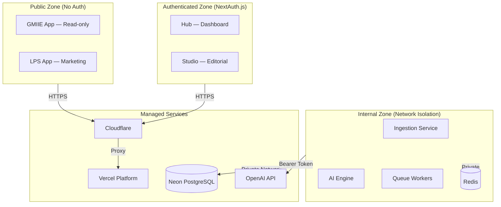
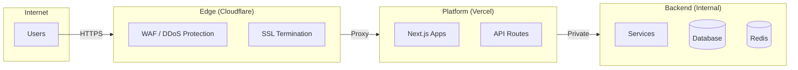

# Security Model

> **Status:** Complete · **Last Updated:** 2025-01

## Overview

XXXIII.IO employs a defense-in-depth security model with layered controls across authentication, authorization, data protection, network isolation, and observability. This document describes the security architecture as implemented.

## Trust Boundaries

## Authentication & Authorization

| Surface | Mechanism | Details |
|---------|-----------|---------|
| Studio | NextAuth.js | Session-based, RBAC roles (admin, editor, viewer) |
| Hub | NextAuth.js | Session-based, admin access |
| GMIIE | None (public) | Read-only content, no user data |
| LPS | None (public) | Static marketing pages |
| AI Engine | Network isolation | Internal service, not internet-exposed |
| Queue Workers | Network isolation | Internal service, not internet-exposed |
| Ingestion | Network isolation | Internal service, not internet-exposed |
| OpenAI API | Bearer token | Server-side only, key in environment variables |
| Database | Connection string | SSL-enforced, Neon managed credentials |

## Data Protection

### Input Validation
- **Zod schemas** validate all incoming data at API boundaries
- **Prisma parameterized queries** prevent SQL injection
- **sanitize-html** strips dangerous HTML from ingested content
- **Content Security Policy** headers on all public-facing apps

### Data at Rest
- PostgreSQL (Neon) — encrypted at rest by provider
- Redis — ephemeral queue data, no persistent sensitive storage
- Environment variables — stored in Vercel encrypted environment

### Data in Transit
- All external traffic over HTTPS (Cloudflare SSL termination)
- Internal service communication via private network
- Database connections use SSL (`sslmode=require`)

### Sensitive Data Handling
- API keys stored exclusively in environment variables
- No secrets in source code or configuration files
- `.env` files excluded via `.gitignore`
- Session tokens are httpOnly, secure, sameSite cookies

## Content Security

| Control | Implementation |
|---------|---------------|
| XSS Prevention | sanitize-html on ingestion, React auto-escaping, CSP headers |
| CSRF Protection | NextAuth.js CSRF tokens on authenticated routes |
| SQL Injection | Prisma ORM parameterized queries (no raw SQL) |
| Input Validation | Zod schemas on all API request bodies |
| Rate Limiting | Vercel edge rate limiting on API routes |
| Dependency Scanning | Dependabot alerts enabled |

## Service Isolation

## Environment Variable Security

| Variable Category | Storage | Access |
|-------------------|---------|--------|
| Database URLs | Vercel Environment | Server-side only |
| OpenAI API Key | Vercel Environment | AI Engine service only |
| NextAuth Secret | Vercel Environment | Auth-enabled apps only |
| Redis URL | Vercel Environment | Queue service only |
| Cloudflare Tokens | Vercel Environment | Deployment only |

## Audit & Observability

- **AuditLog model** tracks user actions in Studio (who, what, when)
- **Structured logging** via `structlog` (Python) and console (Node.js)
- **Queue job tracking** via QueueJob model with status, timestamps, error details
- **Vercel Analytics** for application performance monitoring
- **Neon dashboard** for database query analysis

## Incident Response

| Step | Action | Owner |
|------|--------|-------|
| 1 | Identify via monitoring/alerts | On-call |
| 2 | Assess severity (Critical/High/Medium/Low) | On-call |
| 3 | Contain — disable affected service if needed | Engineering |
| 4 | Investigate root cause | Engineering |
| 5 | Remediate and deploy fix | Engineering |
| 6 | Post-mortem within 48 hours | Team |

## Cross-References

- [SECURITY.md](../../SECURITY.md) — Vulnerability reporting policy
- [Threat Model](threat-model.md) — Threat analysis and mitigations
- [Deployment Guide](../operations/deployment-guide.md) — Secure deployment procedures
