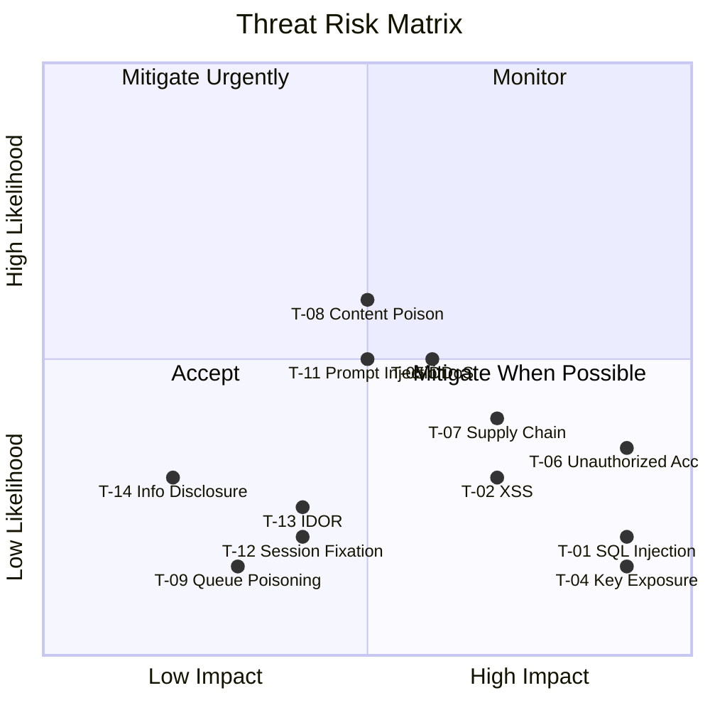

# Threat Model

> **Status:** Complete · **Last Updated:** 2025-01

## Scope

This threat model covers the XXXIII.IO platform attack surfaces: public-facing applications, authenticated editorial tools, backend services, data stores, and third-party integrations.

## Threat Model Table

| # | Threat | Vector | Impact | Severity | Mitigation | Residual Risk |
|---|--------|--------|--------|----------|------------|---------------|
| T-01 | SQL Injection | Malformed API input targeting database queries | Data breach, data corruption | Critical | Prisma ORM parameterized queries; no raw SQL; Zod input validation | Low — no raw SQL in codebase |
| T-02 | Cross-Site Scripting (XSS) | Injected script via ingested content or user input | Session hijacking, defacement | High | sanitize-html on ingestion; React auto-escaping; CSP headers | Low — multiple defense layers |
| T-03 | CSRF on Authenticated Routes | Forged requests from malicious sites targeting Studio/Hub | Unauthorized editorial actions | High | NextAuth.js CSRF token validation; SameSite cookie policy | Low |
| T-04 | API Key Exposure | Leaked OpenAI/database credentials in source or logs | Financial loss, data breach | Critical | Keys in Vercel encrypted env only; .gitignore excludes .env; no logging of secrets | Low — env-only storage |
| T-05 | Denial of Service (DDoS) | Volumetric attack on public-facing apps | Service unavailability | High | Cloudflare DDoS protection; Vercel edge rate limiting | Medium — dependent on Cloudflare tier |
| T-06 | Unauthorized Admin Access | Credential stuffing or session theft targeting Studio | Content manipulation, data exfiltration | Critical | NextAuth.js session management; RBAC roles; httpOnly/secure cookies | Medium — no MFA currently |
| T-07 | Supply Chain Attack | Compromised npm/PyPI dependency | Code execution, data exfiltration | High | Dependabot alerts; pnpm lockfile integrity; CI lint + type checks | Medium — large dependency tree |
| T-08 | Ingested Content Poisoning | Malicious content from RSS/web sources | XSS via stored content; misinformation | High | sanitize-html sanitization; AI classification review; editorial review queue | Low — triple validation |
| T-09 | Queue Poisoning | Malformed jobs injected into BullMQ | Service disruption, data corruption | Medium | Internal network isolation; Zod validation on job payloads; Redis auth | Low — not internet-exposed |
| T-10 | Database Connection Hijacking | Man-in-the-middle on database connection | Data interception | High | SSL-enforced connections (`sslmode=require`); Neon managed networking | Low |
| T-11 | AI Prompt Injection | Manipulated content designed to alter GPT-4o behavior | Incorrect classification, biased output | Medium | Structured JSON output schemas; system prompt isolation; output validation | Medium — evolving attack surface |
| T-12 | Session Fixation | Attacker pre-sets session ID for victim | Account takeover | Medium | NextAuth.js session regeneration on login; secure cookie attributes | Low |
| T-13 | Insecure Direct Object Reference | Enumerable IDs in API routes | Data leakage across tenants | Medium | Authorization checks on data access; scoped Prisma queries | Low — single-tenant platform |
| T-14 | Information Disclosure via Errors | Verbose error messages exposing internals | Architecture reconnaissance | Low | Production error boundaries; structured error responses; no stack traces in production | Low |
| T-15 | Redis Data Exposure | Unauthenticated Redis access | Queue data leakage, job manipulation | Medium | Redis AUTH enabled; network isolation; no sensitive data in queue payloads | Low |

## Risk Summary

## Recommended Improvements

| Priority | Improvement | Addresses |
|----------|------------|-----------|
| P0 | Implement MFA for Studio/Hub authentication | T-06 |
| P1 | Add rate limiting on API routes (per-endpoint) | T-05 |
| P1 | Implement AI output validation layer | T-11 |
| P2 | Add dependency audit to CI pipeline | T-07 |
| P2 | Implement structured logging with sensitive data masking | T-04, T-14 |
| P3 | Add runtime integrity checks for queue payloads | T-09 |
| P3 | Implement API versioning with deprecation policy | T-13 |

## Cross-References

- [Security Model](security-model.md) — Full security architecture
- [SECURITY.md](../../SECURITY.md) — Vulnerability reporting
- [Operations Runbooks](../operations/runbooks.md) — Incident response procedures
